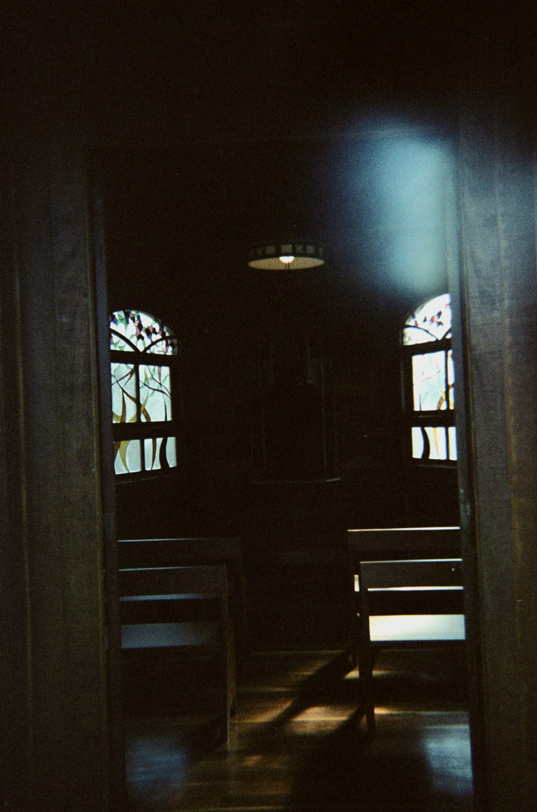
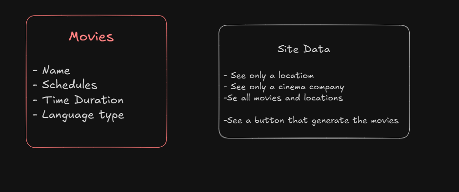
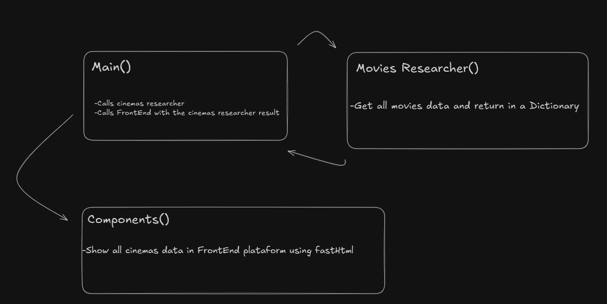

# Cinema searcher project

> Project is designed to search for films showing in cinemas in Belo Horizonte and the surrounding area

## 💻 Instruções para executar o sistema

A seguir, as instruções para executar o sistema:

1. Clone o repositório. `git clone https://github.com/NocceV/Crawler-Cinemas-BH.git`
2. Abra o Visual Studio Code.
3. No Visual Studio Code vá até: `"File" (Arquivo) > "Open Folder" (Abrir Pasta).`
4. Navegue até o diretório onde o repositório foi clonado e selecione a pasta principal do projeto.
5. No visual Studio Code, abra o terminal `Ctrl + Shift + '`.
6. No terminal crie um diretorio virtual para instalar as dependências `python -m venv .venv`.
7. Após a criação do venv, ative o mesmo com o comando `.\venv\Scripts\Activate.ps1`
8. Dê o comando `cd app` para entrar na pasta da aplicação.
9. Com o venv ativado intale as dependencias com `pip install requirements.txt`.
10. Após a instalação execute o programa com o comando `python main.py` e aguarde o resultado que será exibido no local host: `http://localhost:5001`.

## 📒 Premissas assumidas

Lista de condições assumidas para o desenvolvimento do projeto:

- **Usuário:** O usuário final será Vitor e amigos.
- **Objetivos do usuário:** Encontrar todos os filmes e seus respectivos horários e mexibição no dia atual
- **Tecnologia de Acesso:** Navegador Web.
- **Dados:** Cinemas, filmes e horários
- **Cronograma:** 3 semanas de planejamento e desenvolvimento.

## 🤖 Decisões de projeto

### **Front-end:**

- Para o desenvolvimento front-end, foi decidido usar a biblioteca `fasthtml` do python.
    
- **Esboço da arquitetura:**
  

- **Versão Final da Arquitetura**
  

### **Back-end**:

- Para o desenvolvimento do back-end foi escolhido usar a linguagem Python e a biblioteca Selenium para web scraping.
- Inicialmente foram utilizadas as ferramentas: Excalidraw e markdown para o desenho do projeto.
- Logo após, primeiramente foi feito um código funcional, porém simples como protótipo.
- No final, o código foi refatorado, ficando  mais flexível e adaptado para futuras extenções usando conceitos de orientação à objetos.

## 🧩 Tecnologias Utilizadas

- Git
- GitHub
- FastHtml
- Python
- Selenium
- Excalidraw
- VisualStudioCode

 ## 👾 Extra: 

 - Links para os cinemas escohlidos:

- BH Shopping
[BH-Shopping](https://www.ingresso.com/cinema/cinemark-bh-shopping?city=belo-horizonte)

- Boulevard
[Boulevard](https://www.ingresso.com/cinema/cineart-boulevard?city=belo-horizonte)

- Minas Shopping
[Minas](https://www.ingresso.com/cinema/cineart-minas-shopping?city=belo-horizonte)

- Del Rey Shopping
[Del Rey](https://www.ingresso.com/cinema/cineart-del-rey?city=belo-horizonte)

- Diamond mall
[Diamond](https://www.ingresso.com/cinema/cinemark-diamond-mall?city=belo-horizonte)

- Estação Shopping
[Estação](https://www.ingresso.com/cinema/cinepolis-estacao-bh?city=belo-horizonte)

- Pátio Savassi
[Pátio](https://www.ingresso.com/cinema/cinemark-patio-savassi?city=belo-horizonte)
